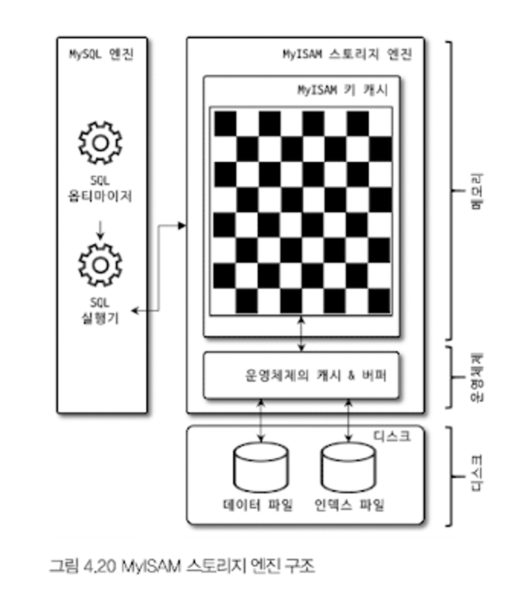

MySQL 서버는 두 가지로 나눌 수 있다
- MySQL 엔진: 사람의 머리 역할을 담당한다
- 스토리지 엔진: 손과 발의 역할을 담당한다
  - 대표적으로 InnoDB와 MyISAM 엔진이 있다

## 1. MySQL 엔진 아키텍처

### 1. MySQL 엔진 아키텍처


#### 1). MySQL 엔진
- 커넥션 핸들러와 SQL 파서 및 전처리기, 옵티마이저가 중심을 이룬다
- 표준 SQL(ANSI SQL) 문법을 지원하기 때문에 타 DBMS와 호환되어 실행될 수 있다
1. 커넥션 핸들러, SQL 파서, 전처리기: 클라이언트로부터 접속 및 쿼리 요청을 처리한다
2. 옵티마이저: 쿼리의 최적화된 실행을 한다

#### 2). 스토리지 엔진
- SQL 문장을 분석하거나 최적화하고, 실제 데이터를 디스크에 저장하거나 읽어오는 부분을 전담한다
- 여러 개의 스토리지 엔진을 사용할 수 있다

#### 3). 핸들러 API
- MySQL 엔진 -> 스토리지 엔진에 요청하는 것을 핸들러 요청이라고 하고, 여기서 사용되는 API를 핸들러 API라고 한다
- 핸들러 API를 통해 얼마나 많은 데이터 작업이 있었는지 `SHOW GLOBAL STATUS LIKE HANDLER%` 명령으로 확인할 수 있다

## 2. MySQL 스레딩 구조
- MySQL 서버는 스레드 기반으로 작동하며 크게 **포그라운드**와 **백그라운드**로 구분할 수 있다
- 백그라운드 스레드이 개수는 MySQL 서버의 설정을 통해 변경할 수 있다


### 1. 포그라운드 스레드(클라이언트 스레드)
- 최소 MySQL 서버에 접속된 클라이언트 수만큼 존재하며 주로 쿼리 문장을 처리한다
- 사용자가 작업을 마치면 해당 스레드는 **스레드 캐시**로 되돌아간다
  - 일정 개수 이상의 대기 중인 스레드가 있다면 스레드 캐시에 넣지 않고 스레드를 종료시킨다
  - 최대 스레드 개수는 `thread_cache_size` 시스템 변수로 설정한다
- 데이터는 MySQL 데이터 버퍼나 캐시로부터 가져오고 없는 경우 직접 디스크의 데이터에서 읽어와서 처리한다

>MyISAM 테이블은 디스크 쓰기 작업까지 포그라운드 스레드가 처리하지만\
InnoDB 테이블은 쓰기 작업은 백그라운드 스레드가 처리한다

### 2. 백그라운드 스레드
- InnoDB에서는 여러 가지 작업이 백그라운드에서 처리된다
1. 인서트 버퍼를 병합하는 스레드
2. 로그를 디스크로 기록하는 스레드
3. InnoDB 버퍼 풀의 데이터를 디스크에 기록하는 스레드
4. 데이터를 버퍼로 읽어 오는 스레드
5. 잠금이나 데드락을 모니터링하는 스레드

>- 5.5 버전부터는 데이터 쓰기 스레드와 읽기 스레드의 개수를 2개 이상 지정할 수 있다
>- 읽기 작업은 주로 클라이언트 스레드로 처리되기 때문에 많이 설정할 필요는 없지만 쓰기 스레드는 많은 작업을 백그라운드에서 처리되기 때문에 내장 디스크는 2~4 정도, DAS나 SAN같은 스토리지를 이용할 때는 충분히 설정하는 것이 좋다
>- InnoDB는 지연(버퍼링)쓰기가 가능하지만 MyISAM은 쓰기 버퍼링 기능을 사용할 수 없다

### 3. 메모리 할당 및 사용 구조
- 메모리 공간은 크게 두 개로 구분할 수 있다


#### 1). 글로벌 메모리 영역
- MySQL 시스템 변수로 설정해 둔 만큼 운영체제로부터 메모리를 할당받는다
- 클라이언트 스레드의 수와 무관하게 하나의 메모리 공간만 할당된다
- 필요에 따라 2개이상 메모리 공간을 할당받을 수 있지만 모든 스레드에 의해 공유된다
- 대표적인 글로벌 메모리 영역
  - 테이블 캐시
  - InnoDB 버퍼 풀
  - InnoDB 어댑티브 해시 인덱스
  - InnoDB 리두 로그 버퍼

#### 2). 로컬 메모리 영역
- 클라이언트 스레드가 쿼리를 처리하는 데 사용하는 메모리 영역이다
- 클라이언트와 MySQL 서버와의 커넥션을 세션이라고 하기 때문에 **세션 메모리 영역**이라고도 표현한다
- 독립적으로 할당되며 쿼리의 용도별로 공간이 할당되고 필요하지 않을 경우 할당조차 하지 않을 수 있다
- 대표적인 로컬 메모리 영역
  - 커넥션 버퍼
  - 정렬(소트) 버퍼
  - 바이너리 로그 캐시
  - 네트워크 버퍼

### 4. 플러그인 스토리지 엔진 모델
- 스토리지 엔진뿐만 아니라 전문 검색 엔진을 위한 검색어 파서, 인증 등도 모두 플러그인으로 구현되어 제공된다
- 사용자가 직접 커스터마이징도 가능하다
- `SHOW PLUGIN` 명령으로 설치되어 있는 플러그인을 확인할 수 있다
- 단점
  - 플러그인은 오직 MySQL 서버와 인터페이스 할 수 있고, 플러그인끼리는 통신할 수 없다
  - 플러그인은 MySQL 서버의 변수나 함수를 직접 호출하기 때문에 안전하지 않다
  - 플러그인은 상호 의존 관계를 설정할 수 없어서 초기화가 어렵다


#### 1. 처리 영역
- 거의 대부분의 작업이 MySQL 엔진에서 처리되고, `데이터 읽기/쓰기`작업만 스토리지 엔진에 의해 처리된다
- 서버 상태변수를 보면 `Handler_`로 시작되는 게 많은데 이는 MySQL 엔진이 각 스토리지 엔진에게 보낸 명령이라고 보면 된다
- 실질적인 `Group By`, `Order By` 등 복잡한 처리는 쿼리 실행기에서 처리된다


### 5. 컴포넌트
- 8.0 부터는 플러그인의 단점을 보완 및 대체하기 위해 컴포넌트 아키텍처가 지원된다
- `INSTALL COMPONENT 'file://component_validate_password'`으로 컴포넌트를 설치한다
- `SELECT * FROM mysql.component`를 통해 컴포넌트를 확인할 수 있다

### 6. 쿼리 실행 구조


#### 1). 쿼리 파서
- 쿼리 문장을 토큰으로 분리해 트리 형태의 구조로 만들어낸다
- 기본 문법 오류는 이 과정에서 발견되고 사용자에게 오류 메시지를 전달한다

#### 2). 전처리기
- 파서 트리를 기반으로 쿼리 문장에 구조적인 문제점이 있는지 확인한다
- 각 토큰을 테이블 이름이나 칼럼 이름 또는 내장 함수와 같은 개체를 매핑해 존재 여부와 접근 권한등을 확인한다

#### 3). 옵티마이저
- 저렴한 비용으로 가장 빠르게 처리할지를 결정하는 역할을 담당한다
- 가장 중요한 역할로 옵티마이저가 더 나은 선택할 수 있도록 유도를 해야 최적화가 좋아진다

#### 4). 실행 엔진
- 만들어진 계획대로 각 핸들러에게 요청해서 받은 결과를 또 다른 핸들러 요청의 입력으로 연결하는 역할을 수행한다
- 즉 결과를 가지고 핸들러에게 요청한다고 보면 된다
```
1. 실행 엔진이 핸들러에게 임시 테이블을 만들라고 요청
2. 다시 실행 엔진은 WHERE 절에 일치하는 레코드를 읽어오라고 핸들러에게 요청
3. 읽어온 레코드들을 1번에서 준비한 임시 테이블로 저장하라고 다시 핸들러에게 요청
4. 데이터가 준비된 임시 테이블에서 필요한 방식으로 데이터를 다시 읽어오라고 핸들러에게 다시 요청
5. 최종적으로 실행 엔진은 결과를 사용자나 다른 모듈로 넘김
```
#### 5). 핸들러(스토리지 엔진)
- 가장 밑단에서 실행 엔진의 요청에 따라 데이터를 디스크로 저장하고 읽어오는 역할을 담당한다
- 핸들러는 스토리지 엔진을 의미한다

### 8. 쿼리 캐시
- 8.0으로 올라가면서 쿼리 캐시는 완전히 삭제되었다

### 9. 스레드 풀
- 엔터프라이즈 에디션만 스레드풀을 지원한다
- 커뮤니티에서도 쓰고 싶다면 Perconda Server에서 스레드풀 플러그인 라이브러리를 설치하면 된다
  - 해당 플러그인은 선순위 큐와 후순위 큐를 이용해 트랜잭션이나 쿼리를 우선적으로 처리할 수 있는 기능도 제공한다

### 10. 트랜잭션 지원 메타데이터
- 메타데이터(데이터 딕셔너리): 테이블의 구조 정보와 스토어드 프로그램 등의 정보이다
- 5.7버전까지는 FRM, TRN 등으로 관리했지만 트랜잭션을 지원하지 않기 때문에 비정상적으로 종료되면 데이터가 깨졌었다
- 8.0 버전부터는 관련 정보를 모두 InnoDB의 테이블에 저장되도록 개선하고, MySQL 서버가 작동하는 데 기본적으로 필요한 테이블(시스템 테이블)을 InnoDB 엔진을 사용하고 `mysql.ibd`라는 이름의 테이블 스페이스에 저장된다
- 하지만 InnoDB가 아닌 MyISAM 같은 엔진은 메타정보를 저장할 곳이 필요하고 이를 SDI 파일을 사용한다
- InnoDB 스키마정보도 SDI 파일로 변환할 수 있고, `show tables` 명령으로 확인할 수 없었던 데이터를 구조를 알 수 있다

## 2. InnoDB 스토리지 엔진 아키텍처


### 1. 프라이머리 키에 의한 클러스터링
- 기본적으로 프라이머리 키를 기준으로 클러스터링되어 저장된다
  - 즉 프라미러 키 값의 순서대로 디스크에 저장된다
- 모든 세컨더리 인덱스는 프라이머리 키 값을 논리적인 주소로 사용한다
- 프라이머리 키가 클러스터링 인덱스이기 때문에 다른 인덱스보다 빨리 처리도리 수 있다
> MyISAM 스토리지 엔진은 클러스터링 키를 지원하지 않고, 모든 인덱스가 물리적인 레코드의 주소 값을 가진다

### 2. 외래 키 지원
- InnoDB에서만 지원하는 기능으로 부모 테이블이나 자식 테이블 모두 해당 칼럼에 인덱스 생성이 필요하다
- 사용 시 복잡해지기 때문에 운영에서는 잘 사용하지 않는다
- `SET foreign_key_checks=OFF`로 외래 키 체크를 멈출 수 있고 다시 실행시켜야 외래키 체크가 가능하다
  - 비활성화시 부모 테이블에 대한 작업(CASCADE)도 무시하게 된다

### 3. MVCC(Multi Version Concurrency Control)
- 레코드 레벨의 트랜잭션을 지원하는 DBMS가 제공하는 기능이며, 가장 큰 목적은 잠금을 사용하지 않는 일관된 읽기 제공이다
- 언두 로그(Undo Log)를 이용해 이 기능을 제공한다
- 멀티버전이라 함은 하나의 레코드에 대해 여러 개의 버전이 동시에 관리되는 의미이다


```
- UPDATE 문을 실행되면 커밋 여부와 상관없이 버퍼 풀은 `서울`로 업데이트 된다
- 커밋 전에 조회를 하게 되면 READ_COMMITED 이상의 격리수준에서는 언두 영역의 데이터를 반환한다
- 즉 하나의 레코드에 대해 2개의 버전이 유지되고, 필요에 따라 어느 데이터를 보여지는지 상황에 따라 달리즈는 구조다
- 롤백을 실행하면 언두 영역에 있는 데이터를 InnoDB 버퍼풀로 다시 복구하고 이 언두영역을 필요로 하는 트랜잭션이 없을 경우 삭제한다
```

### 4. 잠금 없는 일관된 읽기(Non-Locking Consistent Read)
- InnoDB는 MVCC 기술을 이용해 잠금을 걸지 않고 읽기 작업을 수행한다
- 레코드를 변경하고 아직 커밋을 수행하지 않았더라도 언두 로그를 사용해 변경되기 전 데이터를 읽는다
- 이를 통해 잠금없이도 일관된 읽기가 가능한 것이다


### 5. 자동 데드락 감지
- 잠금이 교착상태에 빠지지 않았는지 체크하기 위해 잠금 대기 목록을 그래프형태로 관리한다
- 주기적으로 잠금 대기 그래프를 검사해 교차 상태에 트랜잭션 중 하나를 강제 종료한다
- 이때 어느 트랜잭션을 강제 종료 할 지 판단하는 것은 언두로그의 양이며 더 적을 경우 종료시킨다
- `innodb_table_locks` 시스템을 활성화 시키면 레코드 잠금, 테이블 잠금까지 감지할 수 있게 된다

### 6. 자동화된 장애 복구
- InnoDB 데이터 파일을 기본적으로 서버가 실행될 때 자동 복구를 수행하지만, 자동 복구될 수 없다면 MySQL 서버는 종료된다
- `innodb_force_recovery` 변수를 설정해 서버를 시작해야 한다

### 7. InnoDB 버퍼 풀
- 가장 핵심적인 부분으로, 디스크이 데이터 파일이나 인덱스 정보를 메모리에 캐시해 두는 공간이다
- 쓰기 작업을 지연시켜 일괄 작업으로 처리할 수 있게 해주는 버퍼 역할도 같이 한다

#### 1). 버퍼 풀의 크기 설정
- 전체 메모리의 50%만 버퍼 풀로 설정하고 조금씩 올려가면서 최적점을 찾아야 한다
- `innodb_buffer_pool_size` 시스템 변수로 크기를 설정할 수 있으며, 동적으로 크기를 확장할 수 있다
  - 다만 크기 변경은 크리티컬한 변경이므로 한가한 시점에 진행하는 것이 좋다
  - 버퍼 풀 크기를 줄이는 작업은 서비스 영향도가 매우 크므로 주의를 요하는 것이 좋다
- 내부적으로 128MB 청크 단위로 쪼개어 관리된다
- 각 버퍼 풀은 버퍼 풀 인스턴스로 표현하고, 기본적으로 8개로 초기화된다

#### 2). 버퍼 풀의 구조
- InnoDB 스토리지 엔진은 버퍼 풀이라는 거대한 메모리 공간을 페이지 크기의 조각으로 쪼개어 데이터를 필요로 할 때 해당 데이터 페이지를 읽어서 각 조각에 저장한다
- 버퍼 풀의 페이지 크기 조각을 관리하기 위해서 3개의 자료 구조를 관리한다
1. LRU(Leat Recently Used) 리스트: 엄밀하게 LRU와 MRU(Most Recently Used) 리스트가 결합된 형태이다
2. 플러시(Flush) 리스트: 디스크로 동기화되지 않은 데이터를 가진 데이터 페이지(더티 페이지)의 목록을 관리한다
  - 데이터가 변경되면 리두 로그에 기록하고 버퍼 풀의 데이터 페이지에도 변경 내용을 반영한다
  - 리두 로그가 디스크로 기록됐다고 해서 데이터 페이지가 디스크로 기록됐다는 것을 항상 보장하지 않는다
  - InnoDB는 체크포인트를 발생시켜 디스크의 리두 로그와 데이터 페이지의 상태를 동기화하게 된다
3. 프리(Free) 리스트: 비어있는 페이지들 목록으로, 새롭게 디스크에서 읽어와야 하는 경우 사용된다

> ### LRU 리스트 구조


```
InnoDB에서 데이터를 찾는 과정
1. 필요한 데이터가 저장된 데이터 페이지가 버퍼 풀에 있는지 검사
  - InnoDB 어댑티브 해시 인덱스를 이용해 페이즈를 검색
  - 해당 테이블의 인덱스를 이용해 버퍼 풀에서 페이지 검색
  - 버퍼 풀에 이미 데이터 페이지가 있었다면 해당 페이지의 포인터를 MRU 방향으로 승급
2. 디스크에서 필요한 데이터 페이지를 버퍼 풀에 적재하고, 적재된 페이지에 대한 포인터를 LRU 헤더 부분에 추가
3. 버퍼 풀의 LRU 헤더 부분에 적재된 데이터 페이지가 실제로 읽히면 MRU 헤더 부분으로 이동
  - 다량 읽기의 경우 적재되지만 실제 쿼리에서 사용되지 않을 수도 있으며, 이런 경우 MRU로 이동되지 않음
4. 버퍼 풀에 상주하는 데이터 페이지는 얼마나 최근에 접근했었는지에 따라 나이가 부여되며, 오랫동안 사용되지 않으면 제거된다
  - 데이터 페이지가 사용되면 나이가 초기화되어 다시 젊어지고 MRU의 헤더 부분으로 옮겨진다
5. 필요한 데이터가 자주 접근됐다면 해당 페이지의 인덱스 키를 어댑티브 해시 인덱스에 추가
```

#### 3). 버퍼 풀과 리두 로그
- 버퍼 풀은 크게 설정할수록 쿼리 성능이 빨라진다
- 버퍼 풀은 데이터 캐시와 쓰기 버퍼링 두 가지 용도가 있는데, 쓰기 버퍼링 기능까지 향상시키려면 리두 로그와의 관계를 먼저 이해해야 한다

```
1. 버퍼 풀은 데이터가 변경되지 않은 클린 페이지와 변경 데이터를 가진 더티 페이지를 가지고 있다
2. 더티 페이지는 디스크와 버퍼 풀의 데이터가 다르기 때문에 언젠가 디스크로 기록돼야한다
3. 더티 페이지는 버퍼 풀에 무한정 머무를 수 없다
4. InnoDB에서 리두 로그는 1개 이상의 고정 크기 파일을 연결해서 순환 고리처럼 사용한다
5. 즉 데이터 변경이 계속 발생하면 리두 로그 파일에 기록됐던 `로그 엔트리`는 새로운 로그 엔트리로 덮어 쓰인다
6. 그래서 전체 리두 로그 파일에서 재사용 가능한 공간과 당장 재사용 가능한 공간을 구분해서 관리해야 한다
7. 재사용 불가능한 공간을 `활성 리두 로그`라고 한다
8. 아래 사진에 있는 화살표를 가진 엔트리들이 활성 리두 로그 공간인 것이다
```


```
9. 리두 로그 파일 공간은 계속 순환되어 재사용되지만 매번 기록될 때마다 로그 포지션을 곗고 증가한 값을 가지게 된다(LSN)
10. InnoDB는 주기적으로 체크포인트 이벤트를 발생시켜 리두 로그와 버퍼 풀의 더티 페이지를 디스크로 동기화한다
11. 이렇게 발생한 체크포인트 중 가장 최근 체크포인트 지점의 LSN이 활성 리두 로그 공간의 시작점이 된다
12. 하지만 리두 로그 공간은 계속해서 증가한다
13. 가장 최근 체크포인트의 LSN과 마짐가 리두 로그 엔트리의 LSN의 차이를 체크포인트 에이지라고 한다
14. 즉 체크포인트 에이지는 활성 리두 로그 공간의 크기를 일컫는다
15. 더티 페이지는 특정 리두 로그 엔트리와 관계를 가지고, 체크포인트가 발생하면 체크포인트 LSN보다 작은 리두 로그 엔트리와 관련된 더티 페이지는 모두 디스크로 동기화되어야 한다
```

> 실제 예제
1. InnoDB 버퍼풀은 100GB, 리두 로그 파일 크기는 100MB
  - 체크포인트 에이지도 100MB만 허용되고, 평균 리두 로그 엔트리가 4KB이면 25,000개정도의 더티 페이지만 버퍼 풀에 보관할 수 있다
  - 데이터 페이지가 16KB라면 허용 가능한 전체 더티 페이지 크기는 400MB밖에 안되어 쓰기 버퍼링 효과는 거의 볼 수 없다
1. InnoDB 버퍼풀은 100MB, 리두 로그 파일 크기는 100GB
  - 동일한 방식으로 400GB 더티 페이지를 가질 수 있다
  - 하지만 버퍼 풀 크기가 100MB 이기 때문에 허용 가능한 더티 페이지는 100MB가 된다

#### 4). 버퍼 풀 플러시
- 8.0부터 2개의 플러시 기능으로 더티 페이지를 성능 상 악영향 없이 디스크에 동기화 할 수 있게 됐다

##### (1). 플러시 리스트 플러시
- 리두 로그 공간의 재활용을 위해 주기적으로 오래된 리두 로그 엔트리가 사용하는 공간을 비워야 한다
- 오래된 리두 로그 공간이 지워지려면 반드시 더티 페이지가 먼저 디스크로 동기화돼야 한다
- 더티 페이지를 디스크로 동기화하는 스레드를 `클리너 스레드`라고 하는데 클리너 스레드 하나 당 버퍼 풀 인스턴스를 처리한다
- 더티 페이지가 많을수록 디시크 쓰기 폭발현상이 발생할 가능성이 높아진다
- 어댑티브 플러시를 활성화하면 설정값에 의존하지 않고 알고리즘을 사용해 적절한 수준의 더티 페이지가 유지될 수 있도록 디스크 쓰기를 실행한다
- 기본 값은 10%인데 활동 리두 로그의 공간이 값을 넘어서면 알고리즘이 작동하게 된다

##### (2). LRU 리스트 플러시
- LRU 리스트에서 사용 빈도가 낮은 데이터 페이지들을 제거할 때 사용된다
- 시스템 변수에 설정된 개수만큼 스캔하여 디스크에 동기화하며 클린 페이지는 프리 리스트로 옮긴다

#### 5). 버퍼 풀 상태 백업 및 복구
- 디스크의 데이터가 버퍼 풀에 적재돼 있는 상태를 워밍업이라고 한다
- 잘 워밍업된 상태에서는 그렇지 않을 때보다 몇십 배의 쿼리 처리 속도를 보인다
- 서버를 재시작하는 경우 `innodb_buffer_pool_dump_no`를 사용해 버퍼풀 상태를 백업하고 복구 할 수 있다
- 메타 정보만 저장하기 때문에 용량도 적고 백업도 빨리 적응된다

### 8. Double Write Buffer
- 리두 로그 공간 낭비를 위해 페이지의 변경된 내용만 기록하기 때문에 일부만 기록되면 복구할 수 없을 수 있다
- 이 현상을 파셜 페이지 또는 톤 페이지라고 하는데 비정상 종료등으로 발생할 수 있다
- InnoDB에서는 이 문제를 막기 위해 `Double Write` 기법을 이용한다


```
1. 실제로 기록하기 전에 A ~ E까지의 더티 페이지를 묶어서 DoubleWrite 버퍼에 기록한다
2. 각 더티 페이지를 파일의 적당한 위치에 하나씩 랜덤으로 쓰기를 실행한다
3. 비정상적으로 종료된 경우 DoubleWrite 버퍼와 비교해서 다른 경우 복사한다
```

### 9. 언두 로그
- InnoDB는 DML로 변경되기 이전 데이터를 별도로 백업한다. 이렇게 백업된 데이터를 언두 로그라고 한다

> ### 언두 로그 사용
> 1. 트랜잭션 보장
>     - 트랜잭션이 롤백되면 언두로그를 이용해 복구한다
>2. 격리 수준 보장
>     - 트랜잭션 격리 수준에 맞게 언두 로그에 백업해둔 데이터를 읽어서 반환한다

#### 1). 언두 로그 모니터링
- DML시 커밋을 하지 않아도 실제 데이터 값은 변경을 되고 롤백을 하면 언두 로그 데이터로 복구한다
- 8.0부터 언두 로그 사용 공간을 줄일 수 있다

#### 2). 언두 테이블스페이스 관리
- 언두 로그가 저장되는 공간을 언두 테이블스페이스라고 한다
- 8.0.14부터는 언두 로그는 항상 시스템 테이블스페이스 외부의 별도 로그 파일에 기록된다
- 그리고 동적으로 언두 테이블 스페이스를 추가, 삭제할 수 있다

### 10. 체인지 버퍼
- Insert, Update 시에 데이터 파일 변경뿐만 아니라 인덱스도 업데이트해야 한다
- 버퍼 풀에 인덱스 페이지가 있따면 바로 수행하지만 디스크로 읽어와야 한다면 임시 공간에 저장해두고 필요 시 바로 결과를 반환한다
- 이떄 사용되는 임시 메모리 공간을 체인지 버퍼라고 한다
- 중복을 체크하는 유니크 인덱스는 체인지 버퍼를 사용할 수 없다
- 체인지 버퍼 머지 스레드: 체인지 버퍼에 저장된 인덱스 레크드 조각을 병합하는 백그라운드 스레드
- 기본적으로 버퍼 풀의 25%까지 사용할 수 없고 필요하다면 50%까지 사용하도록 설정할 수 있다

### 11. 리두 로그 및 로그 버퍼
- 리두 로그는 ACID 중에서 D에 해당하는 영속성과 밀접하게 연관되어 있다
- 리두 로그는 비정상적으로 종료됐을 때 데이터를 잃지 않게 해주는 안정장치이다
- 데이터 변경 내용을 먼저 로그로 기록하고 비정상 종료가 발생하면 리두 로그의 내용을 이용해 복구한다

#### 1). 리두 로그 아카이빙
- 8.0부터 리두 로그를 아카이빙할 수 있는 기능이 추가 됐다
- 기존 백업에서는 리두 로그가 빠르게 증가될 경우 백업에 실패할 수도 있었다
- 아카이빙을 통해 안정적으로 저장할 수 있게 됐고, 전부 복사될 동안 세션이 끊어지게 되면 삭제된다

#### 2). 리두 로그 활성화 및 비활성화
- 비정상적으로 종료되도 리두 로그는항상 디스크로 기록된다
- 데이터 복구하거나 대용량 데이터를 한번에 적재하는 경우 리두 로그를 비활성화하면 적재 시간을 단축시킬 수 있다
- 리두 로그가 비활성화된 채로 종료되면 리두 로그를 통한 복구가 불가능하기 떄문에 서버가 시작되지 못할 수도 있다

### 12. 어댑티브 해시 인덱스
- 사용자가 자주 요청하는 데이터에 대해 자동으로 생성하는 인덱스이다
- 자주 읽히는 데이터 페이지 키 값을 이용해 해시 인덱스를 만들고 즉시 찾아가게 만든다
- 해시 인덱스는 `인덱스 키 값`과 `데이터 페이지 주소`가 쌍으로 관리된다
  - 인덱스 키 값: B-Tree 인덱스 고유번호 + B-Tree 인덱스의 실제 키 값
  - 특정 키 값이 어느 인덱스에 속한 것인지 구분해야 하기 때문에 두 개를 합쳐서 키로 만든다
- **도움이 되는 경우**
  - 디스크의 데이터가 InnoDB 버퍼 풀 크기와 비슷한 경우(디스크 읽기가 많지 않은 경우)
  - 동등 조건 검색(동등 또는 In 연산자)이 많은 경우
  - 쿼리가 데이터 중에서 일부 데이터에만 집중되는 경우
- **도움이 안되는 경우**
  - 디스크 읽기가 많은 경우
  - 특정 패턴 쿼리가 많은 경우(조인이나 LIKE 패턴 검색)
  - 매우 큰 데이터의 레코드를 폭넓게 읽는 경우

### 13. InnoDB와 MyISAM, MEMORY 스토리지 엔진 비교
  - MySQL 서버의 모든 기능이 InnoDB기반으로 재편돼서 다른 엔진이 가지는 장점이 사라졌다

## 3. MyISAM 스토리지 엔진 아키텍처
  

### 1. 특징
- 키 캐시
  - InnoDB 버퍼 풀과 비슷한 역할을 하는 것이 키 캐시(키 버퍼)이다
  - 인덱스만 대상으로 작동하며, 거기에 쓰기 작업에 대해서만 부분적으로 버퍼링 역할을 한다
- 운영체제의 캐시 및 버퍼
  - 인덱스를 제외한 데이터에 대해서는 캐시나 버퍼링 기능을 가지고 있지 않다
  - 항상 디스크 읽기 또는 쓰기 작업으로 요청되고 운영체제의 캐시 기능에 의존한다
- 데이터 파일과 프라이머리 키 구조
  - Insert되는 순서대로 데이터 파일에 저장되고 모든 레코드는 `ROWID`라는 물리적인 주솟값을 가진다
  - 프라이머리 키와 인덱스 모두 이 값을 포인터로 가진다

## 4. MySQL 로그 파일
### 1. 에러 로그 파일
- 실행되는 도중에 발생하는 에러나 경고 메시지가 출력되는 로그 파일이다
- `my.cnf`위치에서 `log_error`라는 이름의 파라미터로 정의된 경로에 생성된다
- 별도로 정의되지 않은 경우 `.err`확장자로 생성된다
- 보통 다음과 같은 메시지를 자주 본다
  - MySQL이 시작하는 과정과 관련된 정보성 및 에러 메시지
  - 마지막으로 종료할 때 비정상적으로 종료된 경우 나타나는 InnoDB의 트랜잭션 복구 메시지
  - 쿼리 처리 도중에 발생하는 문제에 대한 에러 메시지
  - 비정상적으로 종료된 커넥션 메시지
  - InnoDB의 모니터링 또는 상태 조회 명령의 결과 메시지
  - MySQL의 종료 메시지

### 2. 제너럴 쿼리 로그 파일
- 실행되는 쿼리를 보고 싶을 때 쿼리 로그를 활성화해서 기록한 내용을 보면 된다
- `SHOW GLOBAL VARIABLES LIKE 'general_log_file'`로 조회하면 경로가 나온다

### 3. 슬로우 쿼리 로그
- `long_query_time` 시스템 변수에 설정한 시간이상 소요된 쿼리가 모두 기록된다
- `log_output`옵션을 통해 테이블에 기록할지 파일로 기록할지 선택할 수 있다
  - Table로 설정하더라도 모두 CSV 스토리지 엔진을 사용하기 때문에 CSV 파일로 저장하는 것과 동일하게 작동한다
- 내용이 많아서 직접 쿼리를 검토하기에는 오래 걸리거나 식별하기 어려울 수 있다. 이럴 때 Percona의 `pt-query-digest`스크립트를 이용하면 쉽게 정렬해서 살펴볼 수 있다